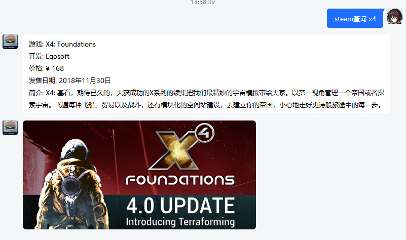

# Steam查询助手

> 本插件基于[mirai](https://github.com/mamoe/mirai-console)
>
> 

## 概览

**这是一个简单粗暴的steam查询插件，可以允许用户通过mirai指令来查询steam商店游戏的价格和简介**

目前本插件强制查询国区和RMB，查询其他区域和其他币种会在后续加入，现在就有需求的可以直接改源代码。

## 指令

~~由于.st指令与骰娘机器人冲突，而斜杠会触发tim用户的快速黄豆人表情，这里使用逗号~~

| 指令                | 效果             |
| ------------------- | ---------------- |
| ,steam查询  [游戏名] | 列出当前游戏信息 |
| ，steam查询 [游戏名] | 列出当前游戏信息 |

## 安装

1. 按照[mirai](https://github.com/mamoe/mirai-console)的步骤安装mirai机器人
2. 从[发布页](https://github.com/Pmx990/Mirai-Steam-Plugin/releases/tag/v0.1)下载jar文件
3. 将jar文件置入mirai安装文件夹下的plugins文件夹

## TODO 和 其他

* 加入更多功能，目前暂定的有

  1. 自定义货币单位
  2. 自定义查询区域
  3. 根据要求列出api中其他信息

* 目前还在研究的功能：

  * 加入历史价格/最低价格对比，由于steam api并不提供此功能，如何解决还在研究中。刚开始的想法是去查询steamdb，但这种行为是被steamdb明令禁止的，所以当前还在寻找更好的解决方案。

* 优化代码，当前很多网址都还是hard coded在代码里的，可以说是trash code中的trash code.~~来只是一时兴起没想这么多~~

  

